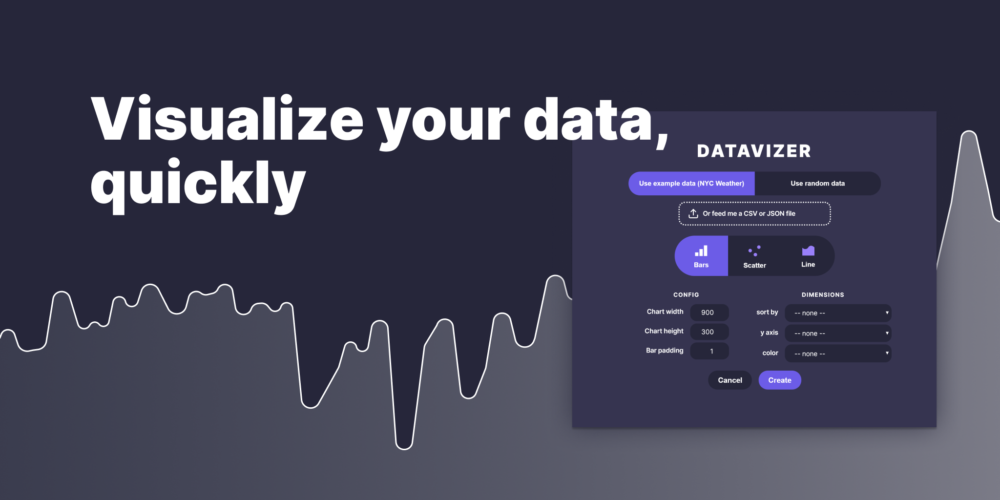

# Davatizer

Create a bar chart, scatter plot, or line chart easily with your own data! Or use a random set of data to quickly create shapes or dummy data (for example, sparklines for a dashboard mockup).

When you upload your own data (CSV or JSON file), we'll grab any numeric keys and allow you to choose one for each relevant dimensions.

Feel free to send me requests & feedback.

# Code overview

The main plugin code is in `src/code.ts`. The HTML for the UI is in
`src/ui.html`, while the embedded JavaScript (using React) is in `src/ui.tsx`.

These are compiled to files in `dist/`, which are what Figma will use to run
your plugin.

To build:

    $ npm install
    $ npm install -g webpack
    $ npm run build

# Todo

Feel free to help out with any of these!

- add axes
- add chart types
    - candlestick chart